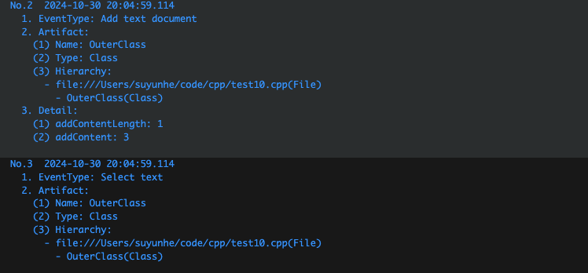
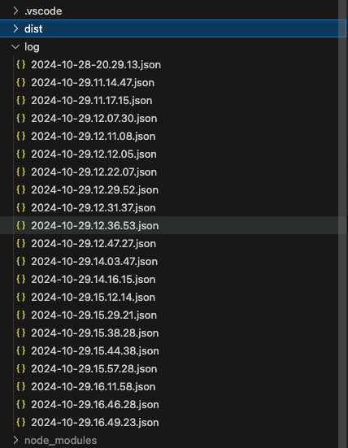
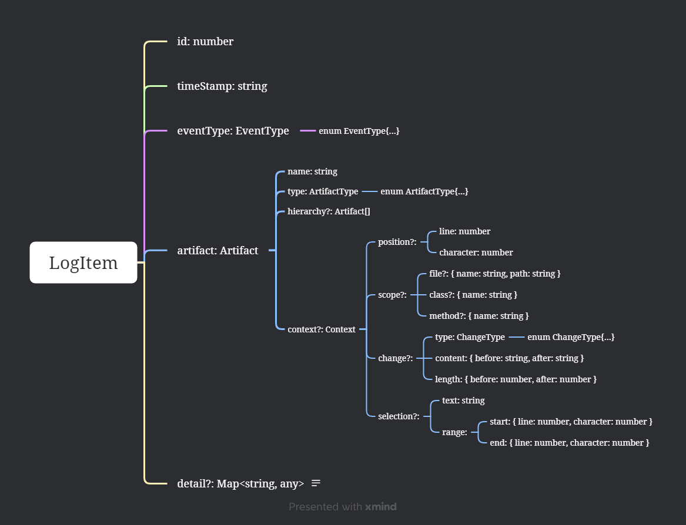

# VirtualME-Demo
## 1. 使用方式

### 1.1. 基本介绍
基于VSCode开发了一个插件，可以监听用户在VSCode的操作，并为每种操作创建日志项，为后续监控和分析他们在开发环境中的行为模式、预测它们的意图提供数据基础。

### 1.2. 使用方式

1. 首次克隆仓库后，在控制台执行 `npm install` 安装项目依赖
2. 在编辑器中，打开 `src/extension.ts` 文件，然后按 `F5` 或者从命令面板运行`Debug: Start Debugging`。这将编译并运行扩展程序在一个新的扩展开发主机窗口中；
3. 按`Ctrl+Shift+P`（Windows）调出命令面板，运行命令`VirtualME Demo`就可以启动插件收集数据；
4. 运行的过程中，收集到的动作会实时log到控制台；
	

4. 停止运行后，动作序列会被输出到一个json文件中。
	


## 2. 数据结构

插件开发时自定义一个`LogItem`类用于记录每一个操作动作，并实现`toString`和`toJSON`方法，用于统一输出，以下是一个输出的json示例。



```json
{
	"id": 37,
	"timeStamp": "2024-10-29 16:49:31.287",
	"eventType": "Add text document",
	"artifact": {
		"name": "file:///Users/suyunhe/code/cpp/test10.cpp",
		"type": "File",
		"hierarchy": [
			{
				"name": "file:///Users/suyunhe/code/cpp/test10.cpp",
				"type": "File"
			},
			{
				"name": "OuterClass",
				"type": "Class"
			},
			{
				"name": "Inne1rClass",
				"type": "Class"
			}
		]
	},
	"detail": {
		"addContentLength": 29,
		"addContent": "// 方法中类示例11111\n// 方法中类示例11111"
	}
}
```

`LogItem`类具有以下属性:
```ts
id: number
timeStamp: string
eventType: EventType
artifact: ArtiFact
detail?: Map<string, any>
```

### 2.1. `id: number`
自增的log项id。每次从1开始自增。

### 2.2. `timeStamp: string`
时间戳，表示动作发生的具体时间。如：`2024-10-29 16:49:31.287`

### 2.3. `eventType: EventType`

事件类型，用于描述行为具体是什么，是一个自定义的枚举类。目前可收集到的动作如下：
```ts
enum EventType {
	/** 打开文件 */
	OpenTextDocument = "Open text document",
	/** 关闭文件 */
	CloseTextDocument = "Close text document",
	/** 切换文件 */
	ChangeTextDocument = "Change text document",
	/** 添加文件内容 */
	AddTextDocument = "Add text document",
	/** 删除文件内容 */
	DeleteTextDocument = "Delete text document",
	/** 修改文件内容 */
	EditTextDocument = "Edit text document",
	/** Redo文件内容 */
	RedoTextDocument = "Redo text document",
	/** Undo文件内容 */
	UndoTextDocument = "Undo text document",
	/** 新建文件 */
	CreateFile = "Create file",
	/** 删除文件 */
	DeleteFile = "Delete file",
	/** 保存文件 */
	SaveFile = "Save file",
	/** 选中文本 */
	SelectText = "Select text",
	/** 打开终端 */
	OpenTerminal = "Open terminal",
	/** 关闭终端 */
	CloseTerminal = "Close terminal",
	/** 切换终端 */
	ChangeActiveTerminal = "Change active terminal",
}
```

### 2.4. `artifact: ArtiFact`
工件，用于描述本次行为操作了哪个工件，是一个自定义类。
`Artifact`类具有以下属性：
```ts
name: string
type: ArtiFactType
hierarchy?: ArtiFact[]
public context?: Context
```

#### 2.4.1. `name: string`
工件的名字，string类型。

#### 2.4.2. `type: ArtiFactType`
工件的类型，是一个自定义的枚举类。目前工件类型主要借鉴了vscode api源码中的定义，如下：
```ts
export enum ArtiFactType {
	File = "File",
	Module = "Module",
	Namespace = "Namespace",
	Package = "Package",
	Class = "Class",
	Method = "Method",
	Property = "Property",
	Field = "Field",
	Constructor = "Constructor",
	Enum = "Enum",
	Interface = "Interface",
	Function = "Function",
	Variable = "Variable",
	Constant = "Constant",
	String = "String",
	Number = "Number",
	Boolean = "Boolean",
	Array = "Array",
	Object = "Object",
	Key = "Key",
	Null = "Null",
	EnumMember = "EnumMember",
	Struct = "Struct",
	Event = "Event",
	Operator = "Operator",
	TypeParameter = "TypeParameter",
	Terminal = "Terminal", // ?
	Unknown = "Unknown"
}
```


#### 2.4.3. hierarchy?: ArtiFact[]
工件所在的层级。实际是一个工件列表，用于保存从最外层(文件级)到目前操作工件的层次结构。

例如，对于`test.cpp`中的以下代码：
```cpp
class OuterClass {
	private:
		int outerData;
		int test;
	public:
		// 嵌套类
		class InnerClass {
			private:
				int innerData;
			public:
				InnerClass() : innerData(0) {}
				InnerClass(int value) : innerData(value) {}
				void setInnerData(int value) { innerData = value; }
				int getInnerData() const { return innerData; }
		}
	};
};
```

`InnerClass`的层次可以描述为`test.cpp` -> `OuterClass` -> `InnerClass`

### 2.5. `detail?: Map<string, any>`

用于按需存储其他信息。例如对于**添加文件内容**可以保存添加内容，**切换终端**可以保存终端对应的进程号等等。