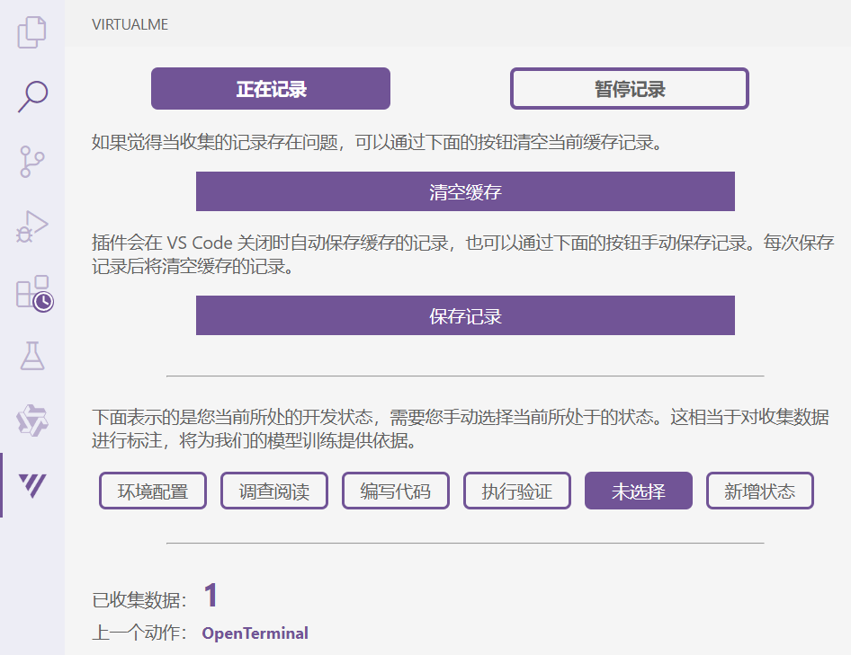

## 插件测试

对目前全部的事件进行了重新测试，测试出现的可修复问题已经修复。

目前剩下的都是较难处理或者影响较小的问题，带星号的表示测试出有问题的事件。

### 文件级事件

| 编号 | 名称           | 符号                 | 最近测试   | 触发条件                     |
| ---- | -------------- | -------------------- | ---------- | ---------------------------- |
| 1-1  | 打开文本文件   | `OpenTextDocument`   | 2025.01.20 | 打开文本文件（忽略特定文件） |
| 1-2  | 关闭文本文件   | `CloseTextDocument`  | 2025.01.20 | 关闭文本文件（忽略特定文件） |
| 1-3  | 切换文本编辑器 | `ChangeTextDocument` | 2025.01.20 | 切换/关闭文本文件            |
| 1-4  | 新建文件       | `CreateFile`         | 2025.01.20 | 新建文件（忽略特定文件）     |
| 1-5  | 删除文件       | `DeleteFile`         | 2025.01.20 | 删除文件（忽略特定文件）     |
| 1-6  | 保存文件       | `SaveFile`           | 2025.01.20 | 保存文件（忽略特定文件）     |
| 1-7  | 重命名文件     | `RenameFile`         | 2025.01.20 | 重命名文件（忽略特定文件）   |
| 1-8  | 移动文件       | `MoveFile`           | 2025.01.20 | 移动文件（忽略特定文件）     |

> 系统性问题：过滤规则可能会误过滤不应该被过滤的内容

### 文本内容相关事件

| 编号 | 名称         | 符号                 | 最近测试   | 触发条件                     |
| ---- | ------------ | -------------------- | ---------- | ---------------------------- |
| 2-1* | 添加文件内容 | `AddTextDocument`    | 2025.01.20 | 添加文件内容                 |
| 2-2* | 删除文件内容 | `DeleteTextDocument` | 2025.01.20 | 删除文件内容                 |
| 2-3  | 修改文件内容 | `EditTextDocument`   | 2025.01.20 | 修改文件内容                 |
| 2-4  | 重做文件内容 | `RedoTextDocument`   | 2025.01.20 | 重做文件内容                 |
| 2-5  | 撤销文件内容 | `UndoTextDocument`   | 2025.01.20 | 撤销文件内容                 |
| 2-6* | 选中文本     | `SelectText`         | 2025.01.20 | （鼠标、键盘或命令）选中文本 |
| 2-7  | 鼠标悬停     | `MouseHover`         | 2025.01.20 | 鼠标在代码上悬停1秒以上      |

> 2-1 & 2-2 合并记录粗测有问题
>
> 2-6 保存选中操作会有滞后性

### 终端事件

| 编号 | 名称               | 符号                     | 最近测试   | 触发条件         |
| ---- | ------------------ | ------------------------ | ---------- | ---------------- |
| 3-1  | 打开终端           | `OpenTerminal`           | 2025.01.20 | 打开终端         |
| 3-2  | 关闭终端           | `CloseTerminal`          | 2025.01.20 | 关闭终端         |
| 3-3  | 切换终端           | `ChangeActiveTerminal`   | 2025.01.20 | 切换终端         |
| 3-4* | 执行终端命令       | `ExecuteTerminalCommand` | 2025.01.20 | 在终端执行命令   |
| 3-5  | 获取调试控制台输出 | `DebugConsoleOutput`     | LSW        | （当前存在问题） |

> 3-4 命令的执行结果输出无法完全正确记录

### 命令执行事件

这部分目前结构比较奇怪，考虑后续进行重构

| 编号 | 名称       | 符号 | 最近测试   | 触发条件 |
| ---- | ---------- | ---- | ---------- | -------- |
| 4-1  | 执行菜单项 |      | 2025.01.20 |          |

## 细节优化

增加界面功能，修复 bug

