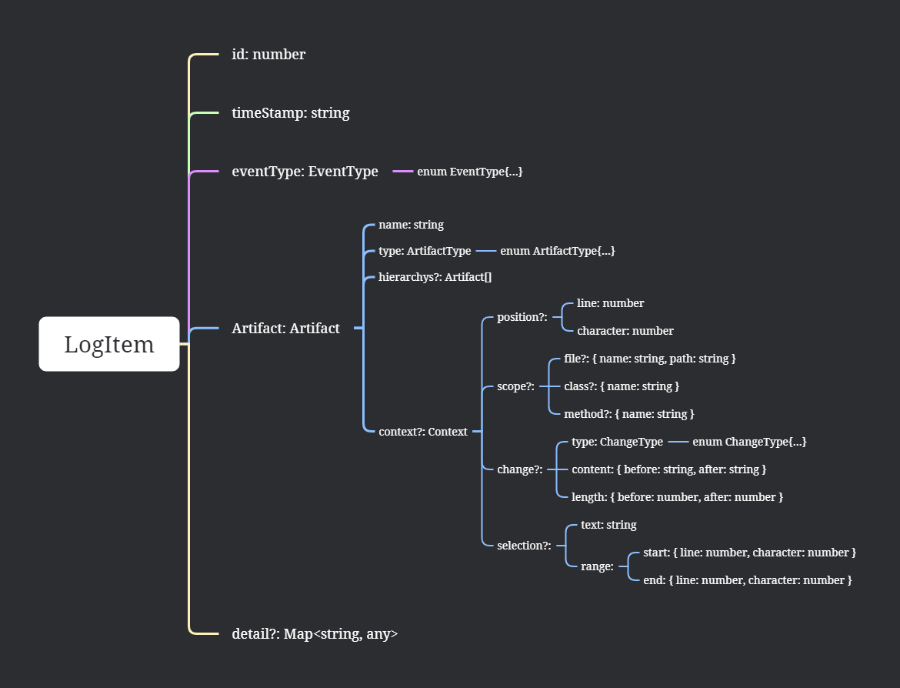
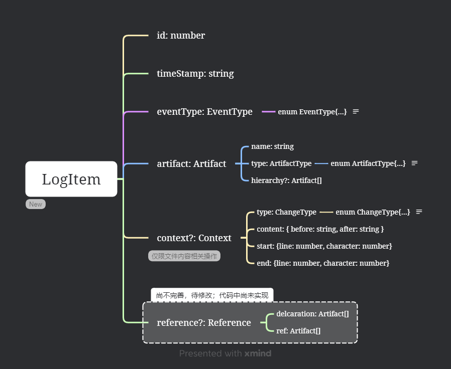

# 1114

## 上周TODO

### 工作流挖掘

*简述一下调研情况*

### 数据集收集和构建

在使用插件构建数据集之前，我们对开发的插件进行了一次测试，发现之前的插件有一些功能有问题。而且保存时间的数据结构也有一些不合理。如下图，`LogItem` 是用于保存每个动作的数据结构，其中 `Artifact` 属性用于记录当前操作相关的工件和工件层级。这部分数组组织比较混乱，需要修改。

之前开发缺少协作，插件难以继续扩展，因此我们本周进行了插件架构的重新讨论，目前正在对插件进行重新开发，为了便于后续使用者了解插件，我们也在开发的过程中撰写相关文档。



插件的发布和数据集的收集和构建需要延迟一段时间。

由于开发者在IDE中的能被收集到的动作非常多，因此一个人的开发就能收集到非常多的数据。因此前期测试和训练模型只需要几个人贡献数据即可。

### 操作粘性的设置

由于插件正在重新开发，该问题后置了。

## 本周工作

> **项目地址**
>
> https://github.com/iseg-ide-sub1/virtual-me

### 数据结构重新设计

简化 `Artifact` 属性，将 `Context` 属性拆分出来，用于记录复杂的记录文本变化的内容。根据模型设计同学的想法，新增 `Refernence` 属性，用于保存工件之间的关系。



### 收集动作数据类型的重新分类

我们按开发者对IDE中对象的操作情况，主要分为对文件、对文件内容和对终端三大操作对象。并分别安排人员实现。在新的开发流程下，分工会更加明确和合理，后续有新的功能开发也会更加容易。

#### 文件级事件

| 编号 | 名称           | 符号                 | 实现情况 | 开发人员 |
| ---- | -------------- | -------------------- | -------- | -------- |
| 1-1  | 打开文本文件   | `OpenTextDocument`   |          |          |
| 1-2  | 关闭文本文件   | `CloseTextDocument`  |          |          |
| 1-3  | 切换文本编辑器 | `ChangeTextDocument` |          |          |
| 1-4  | 新建文件       | `CreateFile`         |          |          |
| 1-5  | 删除文件       | `DeleteFile`         |          |          |
| 1-6  | 保存文件       | `SaveFile`           |          |          |
| 1-7  | 重命名文件     | `RenameFile`         | X        |          |
| 1-8  | 移动文件       | `MoveFile`           | X        |          |
| 1-9  | 粘贴文件       | `PasteFile`          | X        |          |

#### 文本内容相关事件

| 编号 | 名称         | 符号                 | 实现情况 | 开发人员 |
| ---- | ------------ | -------------------- | -------- | -------- |
| 2-1  | 添加文件内容 | `AddTextDocument`    |          |          |
| 2-2  | 删除文件内容 | `DeleteTextDocument` |          |          |
| 2-3  | 修改文件内容 | `EditTextDocument`   |          |          |
| 2-4  | 重做文件内容 | `RedoTextDocument`   |          |          |
| 2-5  | 撤销文件内容 | `UndoTextDocument`   |          |          |
| 2-6  | 选中文本     | `SelectText`         |          |          |
| 2-7  | 查找文件内容 |                      | X        |          |
| 2-8  | 替换文件内容 |                      | X        |          |
| 2-9  | 重命名符号   |                      | X        |          |
| 2-10 | 文本跳转     |                      | X        |          |

#### 终端事件

| 编号 | 名称         | 符号                   | 实现情况 | 开发人员 |
| ---- | ------------ | ---------------------- | -------- | -------- |
| 3-1  | 打开终端     | `OpenTerminal`         |          |          |
| 3-2  | 关闭终端     | `CloseTerminal`        |          |          |
| 3-3  | 切换终端     | `ChangeActiveTerminal` |          |          |
| 3-4  | 执行终端命令 |                        | X        |          |
| 3-5  | 终端输出内容 |                        | X        |          |

#### 其他事件

| 编号 | 名称     | 符号 | 实现情况 | 开发人员 |
| ---- | -------- | ---- | -------- | -------- |
| 4-1  | 鼠标滚动 |      | X        |          |
| 4-2  | 版本控制 |      | X        |          |

### 编写文档

1. 编写开发记录文档，用于协作开发
2. 编写插件架构文档，用于更好地理解需要开发的功能
3. 为每个事件编写文档，记录每个事件需要保存的信息，既便于以后插件的移植也可以之后改变为用户文档，让用户能了解数据的收集情况。

文档示例：

> **通用属性**
>
> 以下属性为通用属性，每个事件类型都会包含
>
> - `id: number`  在本次记录中的序号
> - `timeStamp: string`  记录本事件的时间戳
> - `eventType: EventType`  事件类型
> - `artifact: Artifact`  操作工件
>   - `name: string` 工件名称
>   - `type: ArtifactType` 工件类型 
>   - `hierarchy?: Artifact[]` 该工件的层级（可能没有）
>
> **1-3** `	CloseTextDocument`
>
> **实现API：**`vscode.window.onDidChangeActiveTextEditor`
>
> **触发条件：**切换文本编辑器时触发。
>
> **注意：**
>
> 1. 切换文本文件时触发，若当前关闭所有编辑视图，`editor` 值为 `undefined`
> 2. 切换编辑视图，会触发两次此事件，第一次 `editor` 值为 `undefined`
> 3. 插件不会记录 `editor` 值为 `undefined` 的情况
>
> **附加属性：**无
>
> **示例数据：**
>
> ```json
>   {
>     "id": 3,
>     "timeStamp": "2024-11-11 15:28:28.243",
>     "eventType": "Change text document",
>     "artifact": {
>       "name": "file:///c%3A/Users/hiron/Desktop/Code/test2.c",
>       "type": "File"
>     },
>     "detail": {}
>   }
> ```
>

### 